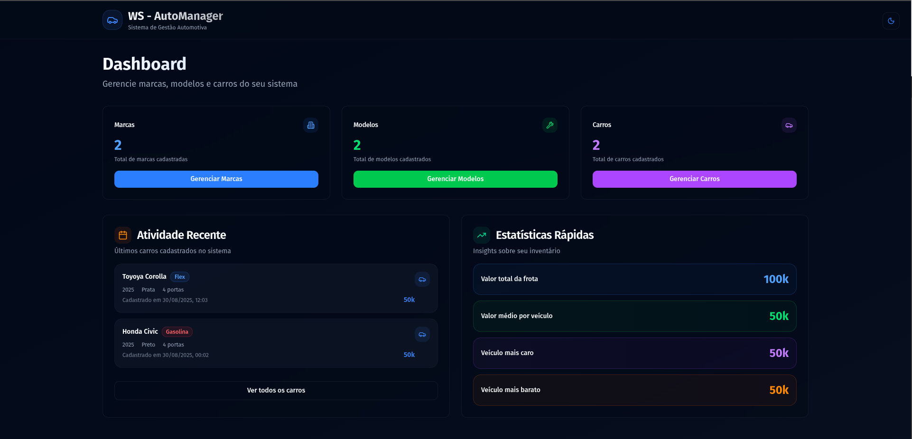
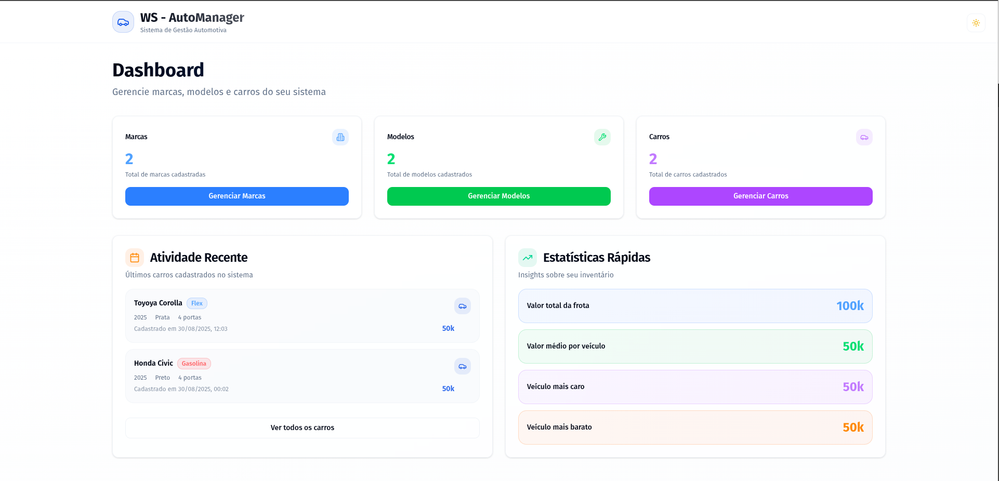

# Front-end - Sistema de Gerenciamento de Carros

Esta é a aplicação front-end para o sistema de gerenciamento de carros, desenvolvida como parte de um desafio técnico. A aplicação é construída com React, TypeScript, Vite, TailwindCSS e diversas bibliotecas modernas, seguindo as melhores práticas de desenvolvimento front-end para garantir uma experiência de usuário excepcional e código de alta qualidade.

## Tabela de Conteúdos

- [Filosofia e Estrutura do Projeto](#filosofia-e-estrutura-do-projeto)
  - [Arquitetura Component-Based](#arquitetura-component-based)
  - [Estrutura de Pastas](#estrutura-de-pastas)
  - [Design System e Componentes](#design-system-e-componentes)
  - [Validação e Tipagem](#validação-e-tipagem)
- [Como Iniciar o Projeto](#como-iniciar-o-projeto)
  - [Pré-requisitos](#pré-requisitos)
  - [Passo a Passo](#passo-a-passo)
- [Storybook - Design System](#storybook---design-system)
- [Padrões de Uso dos Componentes](#padrões-de-uso-dos-componentes)
- [Tecnologias Utilizadas](#tecnologias-utilizadas)
- [Screenshots da Aplicação](#screenshots-da-aplicação)
- [Links Relacionados](#links-relacionados)

---

## Filosofia e Estrutura do Projeto

A aplicação front-end foi desenvolvida seguindo uma arquitetura component-based moderna, priorizando a reutilização de código, manutenibilidade e experiência do desenvolvedor.

### Arquitetura Component-Based

O projeto adota uma estrutura baseada em **Feature-Sliced Design** adaptada para React, onde cada funcionalidade é organizada de forma coesa e autocontida:

- **Pages**: Componentes de página que orquestram a interface de cada funcionalidade
- **Services**: Camada de abstração para comunicação com a API
- **Hooks**: Custom hooks para gerenciamento de estado e lógica reutilizável
- **Schemas**: Validação de dados com Zod
- **Types**: Interfaces TypeScript para tipagem estrita

### Estrutura de Pastas

```text
.
├── public/                  # Arquivos estáticos públicos
│   └── logo.svg
├── src/                     # Código-fonte da aplicação
│   ├── components/          # Componentes React organizados por categoria
│   │   ├── pages/           # Componentes de página para cada funcionalidade
│   │   │   ├── brands/      # Páginas relacionadas a marcas
│   │   │   ├── cars/        # Páginas relacionadas a carros
│   │   │   └── models/      # Páginas relacionadas a modelos
│   │   ├── ui/              # Componentes de UI reutilizáveis (Design System)
│   │   ├── theme-provider.tsx  # Provider para gerenciamento de tema
│   │   └── theme-toggle.tsx    # Componente de alternância de tema
│   ├── hooks/               # Custom hooks para lógica reutilizável
│   │   ├── use-brands.ts    # Hook para gerenciamento de marcas
│   │   ├── use-cars.ts      # Hook para gerenciamento de carros
│   │   ├── use-models.ts    # Hook para gerenciamento de modelos
│   │   └── use-theme.ts     # Hook para gerenciamento de tema
│   ├── lib/                 # Utilitários e configurações
│   │   ├── api-client.ts    # Cliente HTTP para comunicação com a API
│   │   ├── query-provider.tsx  # Provider do React Query
│   │   └── utils.ts         # Funções utilitárias
│   ├── routes/              # Configuração de rotas da aplicação
│   │   └── app-router.tsx   # Router principal
│   ├── schemas/             # Schemas de validação com Zod
│   │   ├── brand.schema.ts  # Validação para marcas
│   │   ├── car.schema.ts    # Validação para carros
│   │   └── model.schema.ts  # Validação para modelos
│   ├── services/            # Camada de serviços para API
│   │   ├── brand.service.ts # Serviços de marcas
│   │   ├── car.service.ts   # Serviços de carros
│   │   └── model.service.ts # Serviços de modelos
│   ├── stories/             # Stories do Storybook para documentação
│   ├── types/               # Definições de tipos TypeScript
│   │   ├── brand.ts         # Tipos para marcas
│   │   ├── car.ts           # Tipos para carros
│   │   └── model.ts         # Tipos para modelos
│   ├── App.tsx              # Componente raiz da aplicação
│   ├── main.tsx             # Ponto de entrada da aplicação
│   └── index.css            # Estilos globais
├── .storybook/              # Configurações do Storybook
├── components.json          # Configuração do shadcn/ui
├── vite.config.ts           # Configurações do Vite
└── package.json             # Dependências e scripts do projeto
```

### Design System e Componentes

A aplicação utiliza um design system baseado em **shadcn/ui** com **Radix UI** e **TailwindCSS**, proporcionando:

- **Componentes Acessíveis**: Todos os componentes seguem as diretrizes de acessibilidade WCAG
- **Tema Customizável**: Suporte completo a dark/light mode
- **Tipagem Estrita**: Todos os componentes possuem tipos TypeScript bem definidos
- **Documentação Visual**: Cada componente possui stories no Storybook

### Validação e Tipagem

- **TypeScript**: Utilizado em 100% do projeto para garantir type safety
- **Zod**: Validação de schemas para formulários e dados da API
- **React Hook Form**: Gerenciamento de formulários com validação integrada
- **TanStack Query**: Gerenciamento de estado servidor com cache inteligente

---

## Como Iniciar o Projeto

Siga os passos abaixo para configurar e executar o ambiente de desenvolvimento localmente.

### Pré-requisitos

- **Node.js**: v22.18 ou superior
- **NPM** (ou um gerenciador de pacotes de sua preferência)
- **Backend API**: Certifique-se de que o backend esteja rodando (veja o [README do Backend](../backend-nodejs/README.md))

### Passo a Passo

1. **Navegue até a pasta do projeto**:

   ```bash
   cd frontend-reactjs
   ```

2. **Instale as dependências**:

   ```bash
   npm install
   ```

3. **Configure as Variáveis de Ambiente**:
   Copie o arquivo de exemplo `.env.example` para um novo arquivo chamado `.env`.

   ```bash
   cp .env.example .env
   ```

   O arquivo `.env` contém as configurações necessárias para conectar com a API backend.

4. **Inicie o servidor de desenvolvimento**:

   ```bash
   npm run dev
   ```

5. **Acesse a aplicação**:
   A aplicação estará disponível em `http://localhost:8080`

### Scripts Disponíveis

- `npm run dev` - Inicia o servidor de desenvolvimento
- `npm run build` - Gera a build de produção
- `npm run preview` - Visualiza a build de produção localmente
- `npm run lint` - Executa o linter
- `npm run lint:fix` - Corrige automaticamente problemas do linter
- `npm run format` - Formata o código com Prettier
- `npm run storybook` - Inicia o Storybook
- `npm run build-storybook` - Gera a build do Storybook

---

## Storybook - Design System

O projeto inclui um **Storybook** completo que documenta todos os componentes do design system. O Storybook serve como:

- **Documentação Visual**: Cada componente possui exemplos visuais de uso
- **Playground Interativo**: Teste diferentes props e estados dos componentes
- **Guia de Acessibilidade**: Verificação automática de critérios de acessibilidade
- **Catálogo de Componentes**: Visão geral de todos os componentes disponíveis

### Como Acessar o Storybook

1. **Execute o comando**:

   ```bash
   npm run storybook
   ```

2. **Acesse no navegador**:
   O Storybook estará disponível em `http://localhost:6006`

### Componentes Documentados

- **UI Components**: Button, Input, Select, Dialog, Table, etc.
- **Data Display**: DataTable com paginação, ordenação e filtros
- **Navigation**: Componentes de navegação e roteamento
- **Feedback**: Toasts, modals de confirmação, loading states
- **Layout**: Cards, containers, layout components

---

## Padrões de Uso dos Componentes

### Estrutura de Hooks Customizados

Cada entidade (brands, cars, models) possui um hook customizado que encapsula toda a lógica de estado:

```typescript
// Exemplo: useBrands()
const {
  brands, // Lista de marcas
  isLoading, // Estado de carregamento
  error, // Erro se houver
  createBrand, // Função para criar marca
  updateBrand, // Função para atualizar marca
  deleteBrand, // Função para deletar marca
  refetch // Função para revalidar dados
} = useBrands();
```

### Padrão de Componentes de Página

Cada página segue uma estrutura consistente:

```typescript
// Estrutura padrão de uma página
export function BrandsPage() {
  const { brands, isLoading, createBrand, updateBrand, deleteBrand } = useBrands();

  return (
    <div className="container mx-auto py-8">
      <PageHeader title="Marcas" />
      <DataTable
        columns={brandsColumns}
        data={brands}
        onAdd={createBrand}
        onEdit={updateBrand}
        onDelete={deleteBrand}
      />
    </div>
  );
}
```

### Padrão de Validação com Zod

Todos os formulários utilizam schemas Zod para validação:

```typescript
// Exemplo de schema
export const brandSchema = z.object({
  name: z.string().min(1, 'Nome é obrigatório')
});

// Uso no formulário
const form = useForm<Brand>({
  resolver: zodResolver(brandSchema)
});
```

### Padrão de Serviços

Os serviços seguem uma interface consistente:

```typescript
export class BrandService {
  static async getAll(): Promise<Brand[]>;
  static async getById(id: string): Promise<Brand>;
  static async create(data: CreateBrandData): Promise<Brand>;
  static async update(id: string, data: UpdateBrandData): Promise<Brand>;
  static async delete(id: string): Promise<void>;
}
```

---

## Tecnologias Utilizadas

### Core

- **React 19** - Library de UI
- **TypeScript** - Linguagem principal
- **Vite** - Build tool e dev server
- **React Router** - Roteamento

### Styling

- **TailwindCSS** - Framework CSS utilitário
- **shadcn/ui** - Biblioteca de componentes
- **Radix UI** - Primitivos de UI acessíveis
- **Lucide React** - Ícones

### Estado e Dados

- **TanStack Query** - Gerenciamento de estado servidor
- **React Hook Form** - Gerenciamento de formulários
- **Zod** - Validação de schemas

### UI/UX

- **Framer Motion** - Animações
- **next-themes** - Gerenciamento de tema
- **Sonner** - Notificações toast

### Desenvolvimento

- **Storybook** - Documentação de componentes
- **ESLint** - Linting
- **Prettier** - Formatação de código

---

## Screenshots da Aplicação




---

## Links Relacionados

- **[📚 Backend - API Documentation](../backend-nodejs/README.md)** - Documentação completa da API REST
- **[🔗 API Base URL](http://localhost:3333)** - Endpoint base da API (desenvolvimento)
- **[📖 Swagger Documentation](http://localhost:3333/docs)** - Documentação interativa da API
- **[🎨 Storybook](http://localhost:6006)** - Design System e componentes
- **[🎯 React Query DevTools](http://localhost:8080)** - Debugging de estado (disponível no dev mode)

### Repositório

- **[🏠 Projeto Principal](../../)** - Raiz do repositório
- **[⚙️ Configuração Docker](../../docker-compose.yml)** - Setup completo com Docker

---

**Desenvolvido com ❤️ usando React + TypeScript + TailwindCSS**
